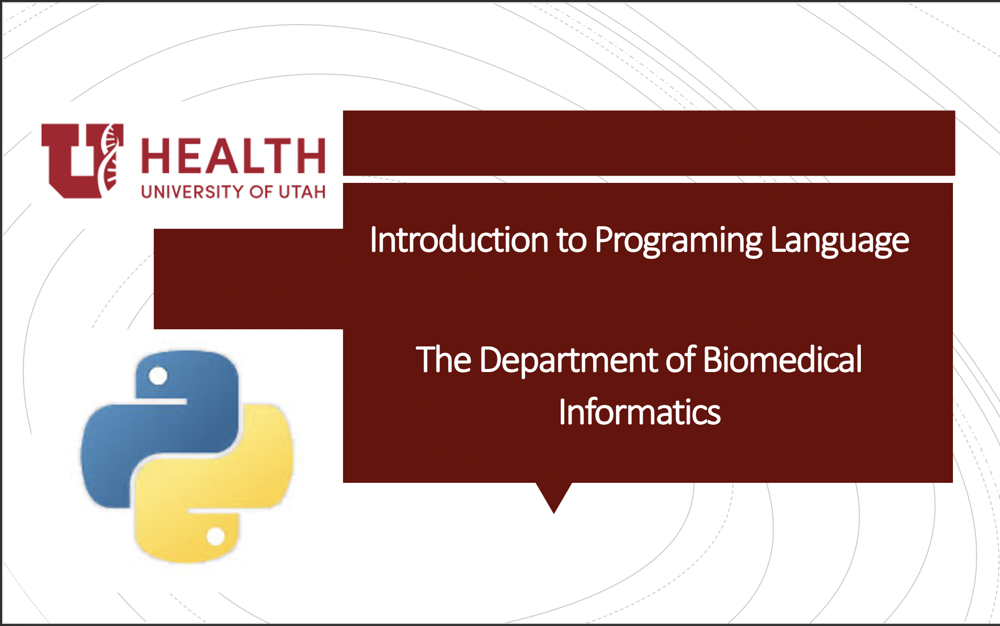

# BMI6018-Fall2020

### Introduction to programing language course   

The course is a 3-credit graduate course in the Department of Biomedical Informatics at the University of Utah. It will equip students with programming skills to develop computer programs and to analyze publicly available datasets in the medical informatics domain. The students will learn python programming skills, their application using widely used platforms, and software version control using git. Mathematical and statistical principles relevant to biomedical data science will be reviewed through programming examples and problems.

<ins><b>Learning Objectives</b></ins>

  1. To understand programming procedural and object-oriented concepts.
  2. To learn python commands and widely used platforms.
  3. To practice algorithmic thinking for solving mathematical, statistical, and biomedical problems in python.
  4. To apply python commands in real-life applications:

